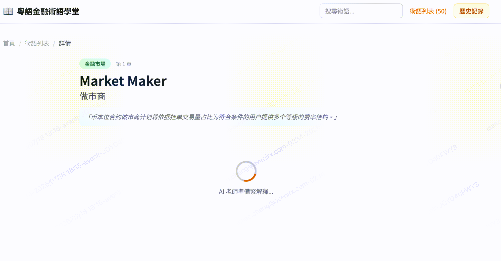
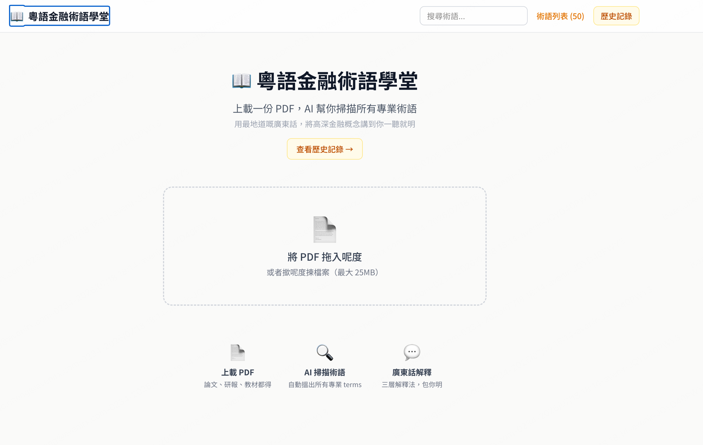
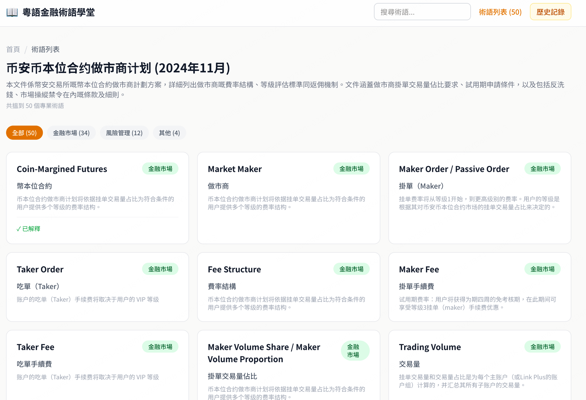
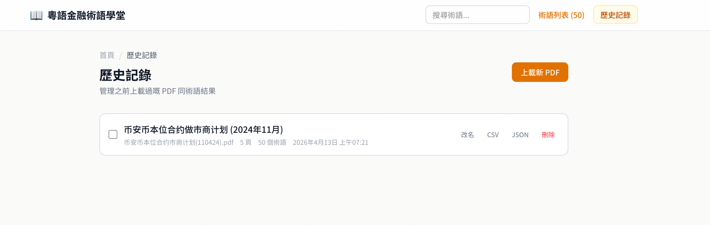

<div align="center">

# 📖 粵語金融術語學堂

**Upload PDF → AI 掃描術語 → 地道粵語解釋**

用最地道嘅廣東話，將高深金融概念講到你一聽就明

[](https://nextjs.org/)
[](https://anthropic.com/)
[](https://sqlite.org/)
[]()

</div>

---

## 🎬 Demo

<div align="center">



</div>

> 上載一份 PDF，AI 即時幫你提取所有金融術語，再用廣東話逐個解釋！

---

## 📸 Screenshots

<table>
  <tr>
    <td align="center"><b>首頁 — 拖拽上載 PDF</b></td>
    <td align="center"><b>術語列表 — 分類瀏覽</b></td>
  </tr>
  <tr>
    <td></td>
    <td></td>
  </tr>
  <tr>
    <td align="center" colspan="2"><b>歷史記錄 — 管理已掃描文件</b></td>
  </tr>
  <tr>
    <td colspan="2" align="center"></td>
  </tr>
</table>

---

## ✨ 功能亮點

| 功能 | 描述 |
|------|------|
| 📄 PDF 上載 | 拖拽或點擊上載，支援論文、研報、教材（最大 25MB） |
| 🤖 AI 術語提取 | Claude AI 自動辨識並提取所有金融專業術語 |
| 🗣️ 粵語解釋 | 三層解釋法 — 簡單版、詳細版、例句，包你明 |
| 🏷️ 分類篩選 | 金融市場 / 風險管理 / 其他，快速搵到你要嘅嘢 |
| 📁 歷史記錄 | 管理所有上載過嘅 PDF，支援匯出 CSV / JSON |
| 🔍 搜索功能 | 即時搜索已提取嘅術語 |

---

## 🚀 Quick Start

```bash
# Clone
git clone https://github.com/isaaccwb/cantonese-finance-tutor.git
cd cantonese-finance-tutor

# Install
npm install

# 設定 AI Provider（詳見下方「AI 設定」）
cp .env.example .env.local
# 編輯 .env.local，選擇 provider 並填入 API Key

# Run
npm run dev
```

打開 http://localhost:3000 就用得！

---

## 🤖 AI 設定

支援多個 AI provider，揀一個你有嘅就得：

| Provider | 費用 | 效果 | 設定 |
|----------|------|------|------|
| **Anthropic (Claude)** | 按量付費 | ⭐⭐⭐ 最好 | `AI_PROVIDER=anthropic` + `ANTHROPIC_API_KEY` |
| **OpenAI (GPT-4o)** | 按量付費 | ⭐⭐⭐ | `AI_PROVIDER=openai` + `OPENAI_API_KEY` |
| **Google Gemini** | 有免費額度 | ⭐⭐ | `AI_PROVIDER=gemini` + `GEMINI_API_KEY` |
| **Groq** | 免費 tier! | ⭐⭐ | `AI_PROVIDER=groq` + `GROQ_API_KEY` |
| **Ollama (本地)** | 完全免費 | ⭐~⭐⭐ | `AI_PROVIDER=ollama`，無需 key |
| **自訂 endpoint** | — | — | `AI_PROVIDER=custom` + URL + key |

### 最快開始（免費）

```bash
# 1. 安裝 Ollama: https://ollama.com
# 2. 下載模型
ollama pull llama3.1

# 3. .env.local 設定
AI_PROVIDER=ollama
```

### 效果最好

```bash
# .env.local
AI_PROVIDER=anthropic
ANTHROPIC_API_KEY=sk-ant-xxxxx
```

詳細設定參考 `.env.example` 文件。

---

## 🛠️ Tech Stack

```
Frontend    →  Next.js 16 · React 19 · Tailwind CSS
AI Engine   →  Multi-provider (Claude / GPT / Gemini / Groq / Ollama)
Database    →  SQLite (better-sqlite3)
PDF Parser  →  pdf-parse
State       →  Zustand
```

---

## 💡 點解做呢個？

> 香港人讀金融，成日要睇英文材料。好多術語就算識英文都未必即刻 get 到個意思。
>
> 如果有個工具可以用廣東話同你解釋，學習效率即刻翻倍！
>
> 呢個就係「粵語金融術語學堂」嘅由來。

---

<div align="center">

Built with ❤️ and Claude AI | Made in Hong Kong 🇭🇰

</div>
